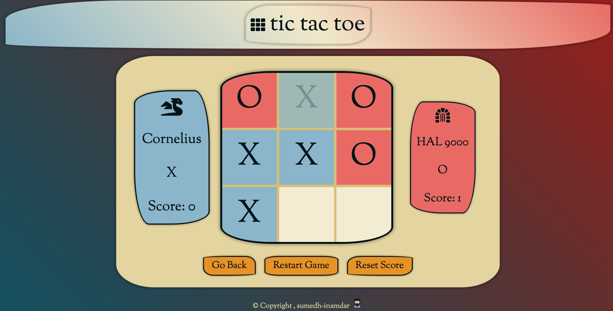

# Tic Tac Toe

<a href="https://sumedh-inamdar.github.io/tic-tac-toe/">link to page</a>

## New lessons / material incorporated
- Factory functions (newPlayer)
- Module patterns (gameBoard, displayController, gameController)
- Private variables and functions through closures
- Use of 2D array to represent gameboard allowing for clean check of winning game

## Features
- Choice of playing human vs human or human vs computer
- Minimax AI algorithm optimized for shortest depth

## To do list:
- [x] Allow more characters for name
- [x] Fix bug: go back from AI screen
- [x] Disable square after click
- [x] Check for three in a row
- [x] Result screen
- [x] Score update
- [x] Add tie round logic
- [x] Add computer AI player
    - [x] Random legal move
    - [x] Minimax alg
- [x] Add footer
- [x] Hover effect over square
- [x] Add styling (1-2 days)

